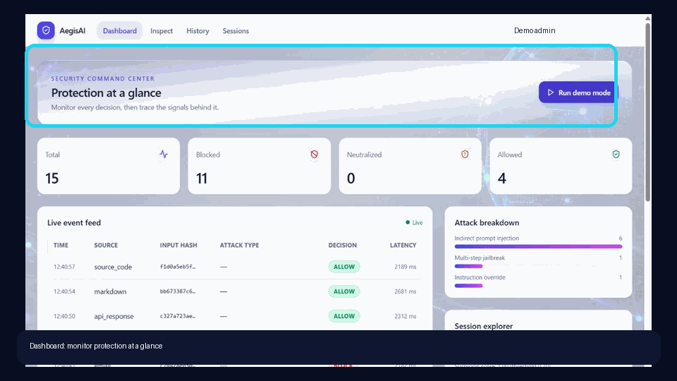

# AegisAI

**AegisAI** is an agentic prompt-injection firewall built as a
production-grade full-stack application for the ET × Accenture AI Hackathon
(Problem 2 — target F3/D3).

**Protect every input before it reaches your AI agent.**

## What is AegisAI

It inspects text destined for downstream LLM agents across three tiers
(regex heuristics, local embedding similarity, LLM judge) and returns an
`ALLOW / NEUTRALIZE / BLOCK` decision with per-tier signals, sanitized
output, and full auditability. It covers all 9 attack types (instruction
override, role change, secret extraction, tool abuse, credential theft,
context poisoning, multi-step jailbreak, encoded instructions, indirect
prompt injection) across all 11 input source types (user messages, web
pages, PDFs, emails, markdown, HTML, Word documents, API responses, OCR
text, source code, images) — see [§2 of the playbook](./AEGISAI_PLAYBOOK.md#2-hackathon-requirement-coverage-f1f3--d1d3)
for the full F3/D3 coverage claim and its evidence.

It ships as a real product, not a naked API: JWT auth, per-user inspection
history, a live metrics dashboard, per-user LLM model selection, session
suspicion tracking for multi-turn jailbreaks, and an admin audit log that
never stores raw inspected text.

## Screenshots



Start the local app with `START.ps1` to view the rebranded dashboard, decision
feed, attack coverage, and session context.

For the full AI-engineering walkthrough—backend components, parser paths,
exact Claude call boundaries, FAISS/Tier 2 behavior, privacy flow, and live
examples for user messages, PDFs, and images—see
[`docs/AI_ENGINEERING_FLOW.md`](./docs/AI_ENGINEERING_FLOW.md).

## Use the portal

1. **Dashboard** is the live control room. It shows total, allowed,
   neutralized, and blocked inspections; the latest event feed; attack
   breakdown; and the most recent session score. **Launch live demo** opens a
   guided replay in Inspect with a scenario queue, progress, stop/replay
   controls, and a live trace for each synthetic inspection.
2. **Inspect** is the manual test console. Pick one of the 11 source types,
   paste content or upload PDF/DOCX/image, and read the decision plus every
   tier's signal. It can also reuse a Session ID and increment a turn number
   to demonstrate a multi-turn jailbreak.
3. **History** is the user's inspection record. Filter it, open any row for
   its reasoning and signals, delete an individual row, or reset your own
   history. Reset never deletes the separate hash-only audit log.
4. **Sessions** turns a repeated Session ID into a suspicion-score timeline.
5. **Settings** changes privacy preferences, detection thresholds, theme,
   and the permitted working/judge models.
6. **Admin users** see **Audit Log** in the account menu. It exposes global
   metrics/events and the privacy-safe audit records; ordinary users cannot
   open `/audit`.

For a guided hands-on tour, including safe fixtures and expected outcomes for
all 11 source types and all 9 attack families, use the
[`manual_test_cases`](./manual_test_cases/README.md) demo kit, including a
[live demo runbook](./manual_test_cases/LIVE_DEMO_RUNBOOK.md).

## Quickstart (Docker)

```bash
cp .env.example .env      # fill in ANTHROPIC_API_KEY at minimum
make up                   # docker-compose up --build — db, backend, frontend
# Backend  -> http://localhost:8000
# Frontend -> http://localhost:3000
# Postgres -> localhost:5432

make seed                 # seed an admin + demo user (see backend/.env / SEED_ADMIN_PASSWORD)
make logs                 # tail all three services
make down                 # stop and remove containers + the db volume
```

Equivalent raw compose commands (what the `Makefile` targets wrap) are in
[§19 of the playbook](./AEGISAI_PLAYBOOK.md#19-devops--docker--local-run).

### Local admin access

There is one login screen, not a separate unprotected admin portal. Seed the
demo users, then sign in as `admin@aegisai.dev` with the value of
`SEED_ADMIN_PASSWORD` in your untracked local `.env`. That value is
intentionally omitted from `.env.example`; choose a unique local credential
before any shared run. Open the account menu and select **Audit Log** (or
visit `/audit`). The seed script also creates a local non-admin demo account
for comparison.

## Local dev (no Docker)

On Windows, the quickest route is:

```powershell
.\START.ps1
# If the seeded admin cannot sign in, reset only that local account:
.\START.ps1 -ResetAdminPassword
# If you change the root .env and want to copy its non-database settings:
.\START.ps1 -SyncBackendEnv
```

The launcher migrates the local database, seeds the demo accounts, starts
FastAPI on `:8000` and Vite on `:3000`, then stops both and removes only
regenerable Vite/pytest caches when its PowerShell session ends. It never
removes your SQLite database, `.env`, uploads, or `node_modules`.

```bash
# 1. Backend
cd backend
python -m venv .venv && source .venv/bin/activate
pip install -r requirements.txt

# The image parser (backend/src/aegisai/parsers/image.py) shells out to
# the tesseract OCR binary via pytesseract when it is available:
#   Debian/Ubuntu: apt-get install tesseract-ocr
#   macOS:         brew install tesseract
#   Windows:       https://github.com/UB-Mannheim/tesseract/wiki
# Without it, AegisAI uses the configured Claude working model as a bounded
# Vision OCR fallback when OCR_VISION_FALLBACK=true. Images are resized before
# either engine runs, and both paths have explicit time limits.

# Tier 2 uses a local sentence-transformers/all-MiniLM-L6-v2 encoder plus a
# FAISS IndexFlatIP vector index on Linux/GHA/Docker. FAISS is the similarity
# index, not an embedding model. Windows/macOS remain supported with the
# equivalent NumPy search when a FAISS wheel is unavailable.
#
# Provision the encoder once before starting the app. Runtime loading is
# local-only, so an inspection never waits for Hugging Face:
python ../scripts/prewarm_tier2.py
# To verify an already-cached/offline installation:
TIER2_PREWARM_LOCAL_ONLY=1 python ../scripts/prewarm_tier2.py
# PowerShell equivalent:
# $env:TIER2_PREWARM_LOCAL_ONLY='1'; python ../scripts/prewarm_tier2.py
# For a pre-baked local model directory, set TIER2_MODEL_PATH in .env.
cp ../.env.example ../.env         # fill in ANTHROPIC_API_KEY
alembic upgrade head
python ../scripts/seed_db.py
uvicorn aegisai.main:app --reload --port 8000

# 2. Frontend
cd ../frontend
npm install
npm run dev                        # http://localhost:3000
```

On Windows, a teammate can run `SETUP_AEGISAI.bat` once from the repository
root. It creates `backend/.venv` if needed, installs both dependency sets,
builds the frontend, and preloads the complete Tier 2 reference index. The
script requires each developer to create their own untracked `.env` first; it
never copies or generates secrets.

Testing (see [`.claude/skills/testing/SKILL.md`](./.claude/skills/testing/SKILL.md)):

```bash
cd backend  && python -m pytest tests/unit tests/integration tests/e2e -v --cov
cd frontend && npm test -- --run
python scripts/run_corpus.py           # 100-case regression corpus, needs the backend running
bash scripts/run_full_suite.sh         # all three, plus a pass/fail banner (CI runs this)
```

## Environment variables

All config is read from `.env` (see [`.env.example`](./.env.example)); nothing
is hard-coded. Full reference: [§17 of the playbook](./AEGISAI_PLAYBOOK.md#17-environment--configuration).

| Variable | Purpose |
|---|---|
| `DATABASE_URL` | Postgres in Docker/prod, SQLite for local dev |
| `JWT_SECRET` | HS256 signing key, min 32 chars — never commit a real one |
| `ACCESS_TOKEN_TTL_MIN` / `REFRESH_TOKEN_TTL_DAYS` | Token lifetimes |
| `ANTHROPIC_API_KEY` | Required for Tier 3 (LLM judge); Tiers 1+2 work without it |
| `CLAUDE_WORKING_MODEL` / `CLAUDE_JUDGE_MODEL` | App-default model IDs — overridable per-user from Settings |
| `OCR_TIMEOUT_S` / `OCR_MAX_DIMENSION` | Local Tesseract process and image-size limits |
| `OCR_VISION_FALLBACK` / `OCR_VISION_TIMEOUT_S` / `OCR_VISION_MAX_DIMENSION` | Bounded Claude Vision fallback when Tesseract is unavailable |
| `TIER2_MODEL_NAME` / `TIER2_MODEL_PATH` | Local Tier 2 encoder ID or pre-baked model directory |
| `TIER2_THRESHOLD` / `TIER2_LOAD_TIMEOUT_S` / `TIER2_STARTUP_TIMEOUT_S` / `SESSION_JAILBREAK_THRESHOLD` | Tier 2 similarity, request/startup readiness waits, and session thresholds |
| `RATE_LIMIT_LOGIN_PER_MIN` / `RATE_LIMIT_INSPECT_PER_MIN` | Per-IP / per-user rate limits |
| `CORS_ALLOWED_ORIGINS` | No wildcard, ever — see [security rules](./.claude/rules/security-rules.md) |
| `SEED_ADMIN_PASSWORD` | Used only by `scripts/seed_db.py` |

## How the pipeline works

Every inspection flows: rate limiter → parser (by source type) → Tier 1
regex + encoded-payload decoder → short-circuit on high confidence →
Tier 2 local MiniLM embedding + FAISS similarity search → Tier 3 LLM judge (with session context) →
session suspicion update → policy engine (`ALLOW` / `NEUTRALIZE` / `BLOCK`)
→ sanitizer → persisted to history + audit log (hash only by default).

Full architecture, the policy table, and the design decisions behind
short-circuiting and source-aware neutralization: [§4 of the playbook](./AEGISAI_PLAYBOOK.md#4-solution-architecture).
The demo narrative for the same pipeline: [`docs/DEMO_SCRIPT.md`](./docs/DEMO_SCRIPT.md).
Manual copy/paste and upload examples: [`manual_test_cases/README.md`](./manual_test_cases/README.md).

## Repository layout

- `backend/`     — FastAPI + SQLAlchemy + Alembic
- `frontend/`    — Vite + React 18 + Tailwind
- `.claude/`     — Claude Code skills, sub-agents, rules, memory
- `test_corpus/` — 100-case regression corpus
- `scripts/`     — corpus runner, full-suite runner, secret scanner
- `docker/`      — Dockerfiles + compose
- `docs/`        — architecture diagrams, demo script
- `manual_test_cases/` — safe Inspect fixtures and expected manual outcomes

## Contributing

This repo is built with Claude Code as a first-class collaborator — read
[`CLAUDE.md`](./CLAUDE.md) before making any change. It links to the full
playbook, the per-module skills under `.claude/skills/`, the sub-agents
under `.claude/agents/`, and the non-negotiable rules under
`.claude/rules/` (coding standards, security, git & secrets, prompt
etiquette). Every non-trivial change appends one line to
[`.claude/memory/progress.md`](./.claude/memory/progress.md).

## License

MIT — see [`LICENSE`](./LICENSE).
